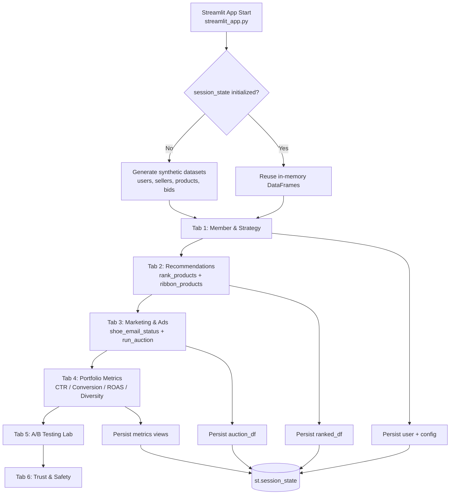

# Blank App Architecture Diagram (6 Tabs)

This document describes the runtime architecture and a safer data contract to prevent the `seller_id` merge failure in auction processing.

## Visual Architecture

## 6-Tab Workflow

1. Tab 1 sets member profile and optimization strategy.
2. Tab 2 computes personalized ranking outputs.
3. Tab 3 executes lifecycle messaging and sponsored auction logic.
4. Tab 4 computes portfolio and marketplace KPIs.
5. Tab 5 runs experimentation workflows in the A/B Testing Lab.
6. Tab 6 surfaces trust, safety, fairness, and governance signals.

## Fixed Workflow (Seller ID Contract)

To avoid `KeyError: 'seller_id'` in `run_auction()`, keep `seller_id` present and unambiguous through every merge boundary:

1. `bids_df` must include: `bid_id`, `seller_id`, `product_id`, `bid_amount`.
2. `products_df` should include product attributes and may include its own seller identifier only if renamed (for example `product_seller_id`) before merging.
3. Auction merge sequence should preserve bid-side `seller_id` as the canonical join key into `sellers_df`.
4. After merging, enforce/validate required columns before scoring:
   - `seller_id`, `product_id`, `category`, `bid_amount`, `is_small_seller`.
5. Only then compute relevance, fairness factor, and final score.

## Module Responsibilities

- `streamlit_app.py`: UI tabs, orchestration, `session_state` lifecycle.
- `data_generator.py`: in-memory synthetic users, sellers, products, bids.
- `ranking.py`: recommendation scoring and ribbon logic.
- `auction.py`: sponsored auction scoring with fairness weighting.
- `metrics.py`: KPI calculations and dashboard metrics.

## Runtime Notes

- Single-process architecture; no external services or database.
- Data is generated once per session and reused via `st.session_state`.
- The current code includes a 7th tab, `Architecture Diagram`, for visual workflow documentation.

